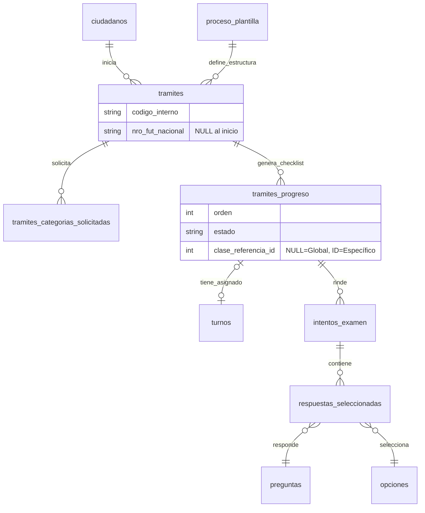

# Guía para Agentes de IA

Este documento contiene información importante para agentes de IA que trabajan en este proyecto.

## Información del Proyecto

**Nombre**: Sistema de Licencias de Conducir - Municipalidad de San Benito  
**Ubicación**: San Benito, Entre Ríos, Argentina  
**Repositorio**: MuniSanBenito/licencias-conducir

## Stack Tecnológico

- **Framework**: Next.js
- **CMS**: Payload CMS
- **Base de datos**: MongoDB
- **Estilos**: Tailwind CSS + DaisyUI
- **Lenguaje**: TypeScript
- **Package Manager**: pnpm

## Convenciones de Código

### Estilo

- **Componentes**: PascalCase (`ExamenPageClient`)
- **Archivos**: kebab-case para componentes cliente (`examen-page-client.tsx`)
- **Server Components**: `page.tsx` por defecto
- **Client Components**: Marcar con `'use client'` al inicio
- **Sintaxis de componentes**: Preferir declaración de función sobre constantes con arrow functions
- **Exports**: Usar named exports. Solo usar `export default` en archivos requeridos por Next.js (`page.tsx`, `layout.tsx`, `loading.tsx`, `error.tsx`, etc.)

  ```tsx
  // ✅ Preferido - Named exports
  export function MiComponente() {}

  // ✅ Solo en archivos de Next.js (page.tsx, layout.tsx, etc.)
  export default function Page() {}

  // ❌ Evitar - Arrow functions y default exports innecesarios
  const MiComponente = () => {}
  export default MiComponente
  ```

### Importaciones

- Usar alias `@/` para imports desde `src/`
- Importar tipos desde `@/payload-types` (generados automáticamente)

### UI/UX

- **Siempre usar componentes de DaisyUI** para diseño (botones, cards, badges, etc.)
- **Iconos**: Usar siempre `@tabler/icons-react` para iconos, nunca SVG directos
- Usar Tailwind solo para layout (flex, grid, spacing)
- Mantener diseño responsivo y accesible
- **Clases dinámicas Tailwind**: Siempre usar `twJoin` o `twMerge` de la librería `tailwind-merge` para componer clases dinámicas. Está prohibido usar string templates (\`${}\`) para clases de Tailwind.

  ```tsx
  // ✅ Preferido - twJoin para concatenar clases condicionales
  import { twJoin } from 'tailwind-merge'

  <div className={twJoin(
    'base-class',
    isActive && 'active-class',
    isDisabled && 'disabled-class'
  )}>

  // ✅ Preferido - twMerge para resolver conflictos de clases
  import { twMerge } from 'tailwind-merge'

  <div className={twMerge('p-4 bg-red-500', customClasses)}>

  // ❌ Evitar - String templates
  <div className={\`base-class ${isActive ? 'active-class' : ''}\`}>
  ```

### Optimización de React

- **NO usar useMemo ni useCallback**: El compilador de React se encarga automáticamente de las optimizaciones de memoización
- **Código directo**: Escribir funciones y cálculos de forma directa sin wrappers de optimización
- **Confiar en el compilador**: React Compiler optimiza automáticamente el código para evitar re-renders innecesarios

  ```tsx
  // ✅ Preferido - El compilador optimiza automáticamente
  const datoComputado = calcularDato()

  const handleClick = () => {
    // lógica
  }

  // ❌ Evitar - Ya no es necesario
  const datoComputado = useMemo(() => calcularDato(), [])
  const handleClick = useCallback(() => {}, [])
  ```

### Internacionalización (i18n)

- **Idioma**: Todos los textos visibles en pantalla deben estar en español
- Evitar textos hardcodeados en inglés en la UI

### Payload CMS

- Usar `basePayload` de `@/web/payload` para Local API
- Los tipos se generan automáticamente en `src/payload-types.ts`
- **Hooks comunes**:
  - `beforeChange` - Validar/modificar datos antes de guardar
  - `afterChange` - Ejecutar lógica después de guardar
  - `beforeValidate` - Validaciones custom
  - `afterRead` - Transformar datos al leer
- **Operaciones CRUD**:

  ```tsx
  // Create
  await basePayload.create({
    collection: 'players',
    data: { name: 'Juan', number: 10 },
  })

  // Read
  const players = await basePayload.find({
    collection: 'players',
    where: { team: { equals: teamId } },
  })

  // Update
  await basePayload.update({
    collection: 'players',
    id: playerId,
    data: { number: 11 },
  })

  // Delete
  await basePayload.delete({
    collection: 'players',
    id: playerId,
  })
  ```

## Los 3 Mandamientos

Se deben cumplir absolutamente siempre:

1. **Siempre respetar principios SOLID**
2. **DRY** (Don't Repeat Yourself)
3. **KISS** (Keep It Simple, Stupid)

## Notas para Agentes

1. **No crear archivos innecesarios**: Solo crear lo estrictamente necesario
2. **KISS (Keep It Simple)**: Preferir soluciones simples y directas
3. **DaisyUI primero**: No inventar componentes custom cuando DaisyUI tiene la solución
4. **Validar tipos**: Siempre verificar que los tipos coincidan con `payload-types.ts`
5. **Hooks de Payload**: Usar `beforeChange`, `afterChange` para lógica de negocio
6. **No adivinar**: Si falta información, preguntar antes de implementar

## 🚨 SEGURIDAD Y DOCUMENTACIÓN - MUY IMPORTANTE

**ESTE ES UN PROYECTO PÚBLICO DE LA MUNICIPALIDAD DE SAN BENITO**

### Reglas estrictas:

1. **NO crear archivos .md innecesarios** (solo README si es absolutamente necesario)
2. **NO agregar comentarios excesivos** en el código
3. **NO documentar información sensible** del sistema
4. **NO incluir detalles de implementación** que puedan exponer vulnerabilidades
5. **NO crear archivos de migración, changelog o documentación técnica detallada**
6. **Comentarios mínimos e indispensables** solamente

### Razones:

- El repositorio es PÚBLICO
- Documentación excesiva puede filtrar información sensible
- Los comentarios innecesarios pueden exponer vulnerabilidades
- Mantener el código limpio y profesional

### Qué SI hacer:

- Código limpio y autoexplicativo
- Nombres de variables/funciones descriptivos
- Tipos de TypeScript claros
- Comentarios solo para lógica compleja no obvia

### Qué NO hacer:

- ❌ Archivos MIGRACION.md, CHANGELOG.md, etc.
- ❌ Comentarios que explican cada línea
- ❌ Documentación de arquitectura detallada
- ❌ Información sobre seguridad o validaciones

## Contexto del Proyecto

Este sistema permite a la Municipalidad de San Benito gestionar exámenes teóricos para licencias de conducir. Los ciudadanos ingresan su DNI, se les asigna un examen con consignas aleatorias según la categoría solicitada, y completan el test. Los administradores gestionan consignas, ciudadanos y exámenes desde el admin de Payload CMS.

### Arquitectura

#### 🎯 Regla de Oro: Client Components por Defecto

**MUY IMPORTANTE**: A diferencia de la convención estándar de Next.js, en este proyecto se debe priorizar el uso de **Client Components** (`'use client'`) por defecto.

- **✅ Client Components**: Usar por defecto para toda la UI interactiva
- **⚠️ Server Components**: SOLO usar en estos casos específicos:
  - Cuando se necesite acceder a `basePayload` de `@/web/libs/payload.ts`
  - Para consultas directas a la base de datos MongoDB vía Payload CMS
  - Para operaciones de lectura que no requieran interactividad

#### 🔄 Server Actions para Mutaciones

**Cuando se necesite modificar datos de Payload** (crear, actualizar o borrar), se DEBE usar Server Actions que:

1. **Retornen obligatoriamente** el tipo `Res<T>` definido en `@/types`:

   ```tsx
   export type Res<T> = ResOK<T> | ResNOK
   ```

2. **Ejemplo de Server Action**:

   ```tsx
   'use server'
   import { basePayload } from '@/web/libs/payload'
   import type { Res } from '@/types'

   export async function createPlayer(data: PlayerData): Promise<Res<Player>> {
     try {
       const player = await basePayload.create({
         collection: 'players',
         data,
       })
       return {
         ok: true,
         message: 'Jugador creado exitosamente',
         data: player,
       }
     } catch (error) {
       return {
         ok: false,
         message: error.message || 'Error al crear jugador',
         data: null,
       }
     }
   }
   ```

3. **Llamar desde Client Components**:

   ```tsx
   'use client'
   import { createPlayer } from './actions'

   export function PlayerForm() {
     const handleSubmit = async (data: PlayerData) => {
       const result = await createPlayer(data)
       if (result.ok) {
         // Éxito: result.data contiene el jugador
       } else {
         // Error: result.message contiene el error
       }
     }
     // ...
   }
   ```

#### Otras Convenciones

11. **Named exports**: Usar named exports excepto en archivos de Next.js
12. **Organización**: Seguir la estructura de carpetas establecida (`components/`, `hooks/`, `lib/`, etc.)

# DBML

```dbml
Table "examen_preguntas" {
  "id" int [pk, not null, increment]
  "examen_id" int [ref: < "examenes"."id"]
  "pregunta_id" int [ref: < "preguntas"."id"]
  "orden" int [default: 0]
  "puntaje" decimal(5,2)

  Indexes {
    (examen_id, pregunta_id) [unique, name: "idx_examen_preguntas_examen_id_pregunta_id"]
  }
}

Table "preguntas" {
  "id" int [pk, not null, increment]
  "enunciado" text [not null]
  "imagen_url" varchar(255)
}

Table "respuestas_seleccionadas" {
  "id" int [pk, not null, increment]
  "intento_id" int [ref: < "intentos_examen"."id"]
  "pregunta_id" int [ref: < "preguntas"."id"]
  "opcion_id" int [ref: < "opciones"."id"]
  Indexes {
    (intento_id, opcion_id) [unique, name: "idx_respuestas_seleccionadas_intento_id_opcion_id"]
  }
}

Table "proceso_plantilla" {
  "id" int [pk, not null, increment]
  "nombre" varchar(100) [not null, note: 'Ej: Workflow Licencia Original']
  "clase_licencia_id" int [ref: < "clases_licencia"."id"]
  "tipo_tramite_id" int
  "activo" boolean [default: true]
}

Table "tramites_categorias_solicitadas" {
  "id" int [pk, not null, increment]
  "tramite_id" int [ref: < "tramites"."id"]
  "clase_licencia_id" int [ref: < "clases_licencia"."id"]
  Indexes {
    (tramite_id, clase_licencia_id) [unique, name: "idx_tramites_categorias_solicitadas_tramite_id_clase_licencia_id"]
  }
}

Table "examenes" {
  "id" int [pk, not null, increment]
  "titulo" varchar(200) [not null]
  "descripcion" text
  "activo" boolean [default: true]
}

Table "tipos_tramite" {
  "id" int [pk, not null, increment, ref: < "proceso_plantilla"."tipo_tramite_id"]
  "nombre" varchar(50) [not null, note: 'Ej: Original, Renovacion, Ampliacion']
}

Table "proceso_pasos" {
  "id" int [pk, not null, increment]
  "plantilla_id" int [ref: < "proceso_plantilla"."id"]
  "etapa_id" int [ref: < "catalogo_etapas"."id"]
  "orden" int [not null]
  "es_bloqueante" boolean [default: true]
}

Table "intentos_examen" {
  "id" int [pk, not null, increment]
  "tramite_progreso_id" int [not null, note: 'Paso Teorico del checklist', ref: < "tramites_progreso"."id"]
  "examen_id" int [ref: < "examenes"."id"]
  "fecha_inicio" datetime
  "fecha_fin" datetime
  "nota_final" decimal(5,2)
  "aprobado" boolean
}

Table "ciudadanos" {
  "id" int [pk, not null, increment]
  "dni" varchar(20) [unique, not null]
  "nombre" varchar(100) [not null]
  "apellido" varchar(100) [not null]
  "email" varchar(100)
  "fecha_nacimiento" date
  "created_at" timestamp
}

Table "clases_licencia" {
  "id" int [pk, not null, increment]
  "codigo" varchar(10) [not null, note: 'Ej: A, B, C, D4']
  "nombre" varchar(100)
  "descripcion" text
}

Table "emisiones_licencia" {
  "id" int [pk, not null, increment]
  "tramite_id" int [unique]
  "fecha_emision" datetime [default: `CURRENT_TIMESTAMP`]
  "usuario_emisor_id" int
  "numero_control_plastico" varchar(50)
}

Table "tramites_progreso" {
  "id" int [pk, not null, increment, ref: < "turnos"."tramite_progreso_id"]
  "tramite_id" int [ref: < "tramites"."id"]
  "etapa_id" int
  "orden" int
  "clase_referencia_id" int [ref: < "clases_licencia"."id"]
  "estado" varchar(20) [default: `PENDIENTE`]
  "aprobado_por_usuario_id" int
  "fecha_aprobacion" datetime
  "observaciones" text
}

Table "catalogo_etapas" {
  "id" int [pk, not null, increment, ref: < "tramites_progreso"."etapa_id"]
  "nombre" varchar(50) [not null, note: 'Ej: Papeles, Curso, Teorico, Practico, Medico']
  "requiere_turno" boolean [default: true]
  "es_digital" boolean [default: false, note: 'Habilita examen en PC']
  "es_carga_fut" boolean [default: false, note: 'Pide cargar ID Nacional']
  "es_multiplicable_por_clase" boolean [default: false, note: 'Si es TRUE (Practico), se genera una fila por cada categoria solicitada']
}

Table "turnos" {
  "id" int [pk, not null, increment]
  "tramite_progreso_id" int [unique, note: 'Se vincula al paso especifico']
  "agenda_recurso_id" int [ref: < "agenda_recursos"."id"]
  "fecha_hora_inicio" datetime
  "fecha_hora_fin" datetime
  "estado" varchar(20) [default: `RESERVADO`]
}

Table "tramites" {
  "id" int [pk, not null, increment, ref: < "emisiones_licencia"."tramite_id"]
  "ciudadano_id" int [ref: < "ciudadanos"."id"]
  "plantilla_id" int [ref: < "proceso_plantilla"."id"]
  "codigo_interno" varchar(50) [unique, note: 'MUNI-2026-XXXX']
  "nro_fut_nacional" varchar(50) [unique, note: 'Se carga antes del teorico']
  "estado_global" varchar(20) [default: `EN_CURSO`]
  "fecha_inicio" datetime [default: `CURRENT_TIMESTAMP`]
}

Table "opciones" {
  "id" int [pk, not null, increment]
  "pregunta_id" int [ref: < "preguntas"."id"]
  "texto_opcion" varchar(255)
  "es_correcta" boolean [default: false, note: 'Soporta Checkboxes']
}

Table "agenda_recursos" {
  "id" int [pk, not null, increment]
  "nombre" varchar(100) [note: 'Ej: Pista de Motos, Box Medico']
  "capacidad" int [default: 1]
}


```

# 🏛️ Sistema de Gestión de Licencias de Conducir - Municipalidad de San Benito

Este repositorio aloja el backend y la lógica de negocio para la gestión integral del ciclo de vida de licencias de conducir. El sistema administra desde la solicitud inicial en mesa de entrada, pasando por validaciones administrativas, cursos, exámenes teóricos (digitales) y prácticos, hasta la emisión final del carnet.

## 🧠 Arquitectura Conceptual

El sistema se basa en tres pilares fundamentales para garantizar flexibilidad y auditoría:

### 1. Patrón "Receta vs. Cocina" (Templates)

Para evitar "hardcodear" los flujos de trámites, el sistema utiliza un modelo de plantillas.

- **La Receta (`proceso_plantilla`):** Define qué pasos (etapas) componen un trámite. _Ej: Una "Renovación B" requiere 1. Papeles, 2. Médico._
- **La Cocina (`tramites`):** Cuando un ciudadano inicia un trámite, el sistema copia la "receta" y crea una instancia viva. Esto permite que si la ley cambia mañana, los trámites viejos mantengan su estructura original.

### 2. Desacople del FUT Nacional

El sistema maneja un doble identificador.

- **ID Interno:** Generado al inicio (Mesa de Entrada). Permite avanzar con pasos municipales (libre deuda, curso).
- **FUT Nacional:** Se inyecta en el sistema a mitad del proceso (generalmente antes del examen teórico). El sistema soporta este "late binding" sin bloquear el flujo inicial.

### 3. Soporte Multi-Categoría (Split-Flow)

Un solo expediente (`tramite`) puede contener múltiples evaluaciones prácticas.

- Si un ciudadano solicita Moto (A) y Auto (B), el sistema unifica la teoría y el médico, pero **bifurca** el examen práctico en dos pasos independientes con resultados distintos.

---

## 🗄️ Estructura de Base de Datos

El esquema relacional se divide en 5 módulos lógicos:

### A. Configuración (Workflow Engine)

Tablas estáticas que definen las reglas de negocio.

- `clases_licencia`: Catálogo de categorías (A, B, C, D4...).
- `catalogo_etapas`: Definición de pasos posibles (flag `es_multiplicable_por_clase` define si el paso se repite por categoría).
- `proceso_plantilla` y `proceso_pasos`: La secuencia ordenada de etapas para cada tipo de trámite.

### B. Core del Trámite (Expediente)

Donde vive la información del ciudadano.

- `tramites`: La cabecera del expediente.
- `tramites_progreso`: El checklist vivo. Controla el estado (`PENDIENTE`, `APROBADO`) de cada paso.
- `tramites_categorias_solicitadas`: Detalla qué licencias se pidieron en este expediente específico.

### C. Logística (Turnos)

- `agenda_recursos`: Aulas, boxes médicos, pistas de manejo.
- `turnos`: Vincula un paso específico del progreso (`tramites_progreso_id`) con un recurso y una fecha.

### D. Exámenes Digitales (Headless Exam System)

Módulo para rendir el teórico en PC.

- `examenes`, `preguntas`, `opciones`: Banco de contenidos. Soporta **Multiple Choice con Checkboxes**.
- `intentos_examen`: Registro de la sesión del alumno.
- `respuestas_seleccionadas`: Guarda cada opción marcada para auditoría detallada.

---

## 🔄 Flujos Críticos

### Flujo de Licencia Multi-Categoría (Ej: A + B)

El sistema resuelve la complejidad de evaluar múltiples vehículos en un solo trámite de la siguiente manera:

1. **Inicio:** Se crea el trámite y se insertan 2 filas en `tramites_categorias_solicitadas` (A y B).
2. **Generación de Pasos:** El backend detecta las categorías y genera el checklist en `tramites_progreso`:

- _Paso 1:_ Papeles (Común a todos).
- _Paso 2:_ Curso (Común a todos).
- _Paso 3:_ **Práctico Moto** (`clase_referencia_id` = A).
- _Paso 4:_ **Práctico Auto** (`clase_referencia_id` = B).
- _Paso 5:_ Médico (Común a todos).

3. **Resultado:** El ciudadano puede aprobar la Moto el martes y desaprobar el Auto el jueves. El trámite no finaliza hasta que todos los pasos bloqueantes se resuelvan.

---

## 📊 Diagrama Entidad-Relación (ERD)



## 🛠️ Stack Tecnológico & Integración

- **CMS/Backend:** Payload CMS (Node.js).
- **Base de Datos:** MongoDB (Base de datos NoSQL utilizada por Payload CMS).
- **Frontend:** Next.js (Consumo de APIs de examen y gestión de turnos).

### Notas para Desarrolladores

1. **Validación de Pasos:** Antes de permitir interactuar con un paso (ej: rendir examen), verificar siempre que el paso anterior con `orden - 1` esté `APROBADO`.
2. **Client Components:** Recordar usar `'use client'` por defecto. Solo usar Server Components para acceder a `basePayload`.
3. **Server Actions:** Todas las mutaciones de Payload deben usar Server Actions que retornen `Res<T>`.
