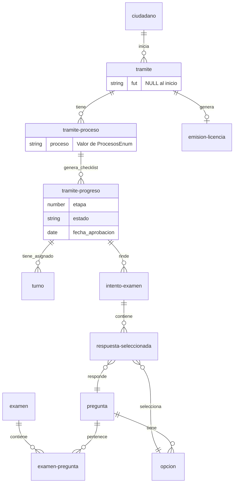

# 🏛️ Sistema de Gestión de Licencias de Conducir - Municipalidad de San Benito

Este repositorio aloja el backend y la lógica de negocio para la gestión integral del ciclo de vida de licencias de conducir. El sistema administra desde la solicitud inicial en mesa de entrada, pasando por validaciones administrativas, cursos, exámenes teóricos (digitales) y prácticos, hasta la emisión final del carnet.

## 🧠 Arquitectura Conceptual

El sistema se basa en tres pilares fundamentales para garantizar flexibilidad y auditoría:

### 1. Patrón "Receta vs. Cocina" (Templates en Código)

Para evitar "hardcodear" los flujos de trámites, el sistema utiliza un modelo de plantillas definidas como constantes TypeScript.

- **La Receta (`ProcesosEnum`):** Define qué pasos (etapas) componen un trámite. _Ej: Una "Licencia Original A1.1" requiere 1. Papeles, 2. Curso, 3. Teórico, 4. Práctico, 5. Psicofísico._
- **La Cocina (`tramite-proceso`):** Cuando un ciudadano inicia un trámite, el sistema asocia un proceso específico y genera el checklist vivo en `tramite-progreso`.

### 2. Desacople del FUT Nacional

El sistema maneja un doble identificador.

- **ID Interno:** Generado automáticamente por MongoDB. Permite avanzar con pasos municipales (libre deuda, curso).
- **FUT Nacional:** Se inyecta en el sistema a mitad del proceso (generalmente antes del examen teórico). El sistema soporta este "late binding" sin bloquear el flujo inicial.

### 3. Configuración Basada en Enums

La configuración del sistema se maneja mediante constantes TypeScript en lugar de tablas de base de datos:

- `ProcesosEnum` - Define los tipos de trámites disponibles y sus pasos
- `EtapasEnum` - Catálogo de etapas (Papeles, Curso, Teórico, Práctico, Psicofísico)
- `AreasEnum` - Áreas donde se asignan turnos (Teórico, Práctico, Psicofísico, etc.)
- `EstadosTramiteEnum` - Estados posibles del trámite (EN CURSO, CANCELADO, FINALIZADO, SUSPENDIDO)
- `LicenciaClaseXEnum` - Clases de licencia (A1.1, A1.2, B1, B2, C1, D1, etc.)
- `TramitesEnum` - Tipos de trámite (Original, Renovación, Ampliación)

---

## 🗄️ Estructura de Base de Datos (MongoDB + Payload CMS)

### Collections Principales

#### A. Gestión de Trámites

- `ciudadano` - Datos del ciudadano (DNI, nombre, apellido, email, fecha nacimiento)
- `tramite` - Cabecera del expediente, vincula ciudadano con sus procesos
- `tramite-proceso` - Asocia un trámite con un proceso específico del `ProcesosEnum`
- `tramite-progreso` - Checklist vivo que controla el estado de cada etapa
- `turno` - Asignación de turnos por área y fecha/hora
- `emision-licencia` - Registro de emisión final de licencias

#### B. Exámenes Digitales

- `examen` - Banco de exámenes teóricos
- `pregunta` - Preguntas con enunciado e imagen opcional
- `opcion` - Opciones de respuesta (soporta múltiples correctas)
- `examen-pregunta` - Relación examen-pregunta con orden y puntaje
- `intento-examen` - Registro de sesiones de examen
- `respuesta-seleccionada` - Cada opción marcada para auditoría

#### C. Sistema

- `usuario` - Usuarios del sistema con autenticación
- `archivo` - Gestión de uploads (imágenes de preguntas, documentos)
- `dev` - Colección de desarrollo para testing

---

## 📊 Diagrama Entidad-Relación (ERD)

## 🛠️ Stack Tecnológico & Integración

- **CMS/Backend:** Payload CMS (Node.js)
- **Base de Datos:** MongoDB
- **Frontend:** Next.js
- **Estilos:** Tailwind CSS + DaisyUI

### Notas para Desarrolladores

1. **Validación de Pasos:** Antes de permitir interactuar con un paso (ej: rendir examen), verificar siempre que la etapa anterior esté completada.
2. **Client Components:** Recordar usar `'use client'` por defecto. Solo usar Server Components para acceder a `basePayload`.
3. **Server Actions:** Todas las mutaciones de Payload deben usar Server Actions que retornen `Res<T>`.
