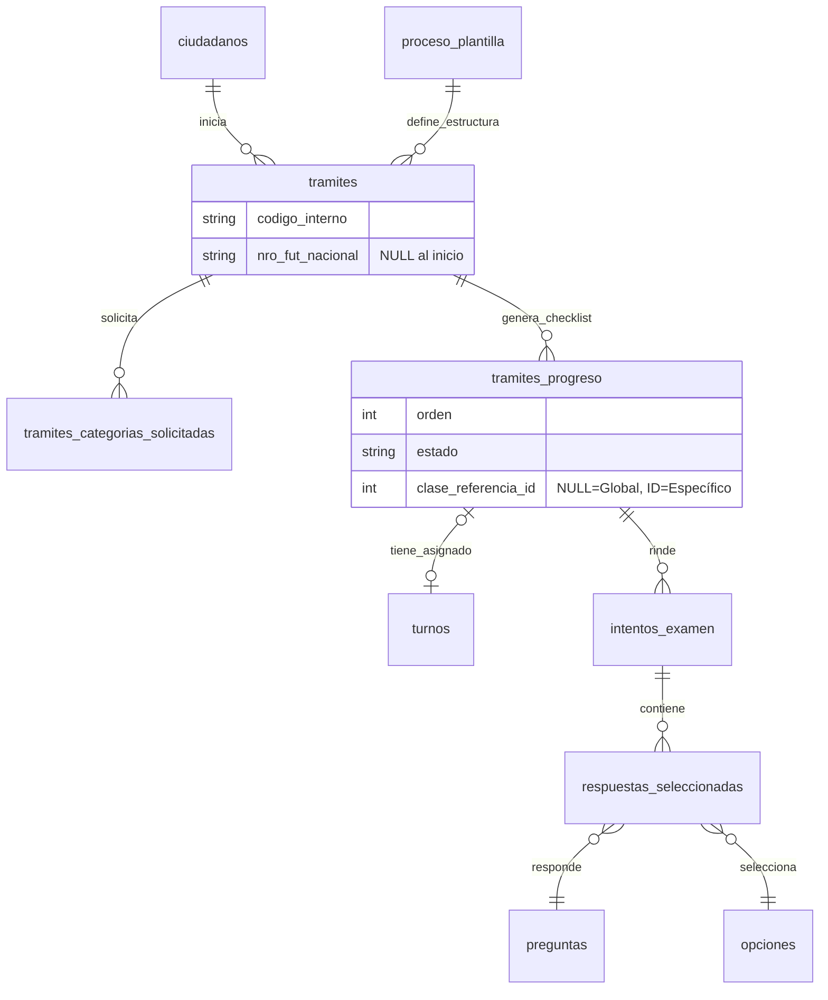

# 🏛️ Sistema de Gestión de Licencias de Conducir - Municipalidad de San Benito

Este repositorio aloja el backend y la lógica de negocio para la gestión integral del ciclo de vida de licencias de conducir. El sistema administra desde la solicitud inicial en mesa de entrada, pasando por validaciones administrativas, cursos, exámenes teóricos (digitales) y prácticos, hasta la emisión final del carnet.

## 🧠 Arquitectura Conceptual

El sistema se basa en tres pilares fundamentales para garantizar flexibilidad y auditoría:

### 1. Patrón "Receta vs. Cocina" (Templates)

Para evitar "hardcodear" los flujos de trámites, el sistema utiliza un modelo de plantillas.

- **La Receta (`proceso_plantilla`):** Define qué pasos (etapas) componen un trámite. _Ej: Una "Renovación B" requiere 1. Papeles, 2. Médico._
- **La Cocina (`tramites`):** Cuando un ciudadano inicia un trámite, el sistema copia la "receta" y crea una instancia viva. Esto permite que si la ley cambia mañana, los trámites viejos mantengan su estructura original.

### 2. Desacople del FUT Nacional

El sistema maneja un doble identificador.

- **ID Interno:** Generado al inicio (Mesa de Entrada). Permite avanzar con pasos municipales (libre deuda, curso).
- **FUT Nacional:** Se inyecta en el sistema a mitad del proceso (generalmente antes del examen teórico). El sistema soporta este "late binding" sin bloquear el flujo inicial.

### 3. Soporte Multi-Categoría (Split-Flow)

Un solo expediente (`tramite`) puede contener múltiples evaluaciones prácticas.

- Si un ciudadano solicita Moto (A) y Auto (B), el sistema unifica la teoría y el médico, pero **bifurca** el examen práctico en dos pasos independientes con resultados distintos.

---

## 🗄️ Estructura de Base de Datos

El esquema relacional se divide en 5 módulos lógicos:

### A. Configuración (Workflow Engine)

Tablas estáticas que definen las reglas de negocio.

- `clases_licencia`: Catálogo de categorías (A, B, C, D4...).
- `catalogo_etapas`: Definición de pasos posibles (flag `es_multiplicable_por_clase` define si el paso se repite por categoría).
- `proceso_plantilla` y `proceso_pasos`: La secuencia ordenada de etapas para cada tipo de trámite.

### B. Core del Trámite (Expediente)

Donde vive la información del ciudadano.

- `tramites`: La cabecera del expediente.
- `tramites_progreso`: El checklist vivo. Controla el estado (`PENDIENTE`, `APROBADO`) de cada paso.
- `tramites_categorias_solicitadas`: Detalla qué licencias se pidieron en este expediente específico.

### C. Logística (Turnos)

- `agenda_recursos`: Aulas, boxes médicos, pistas de manejo.
- `turnos`: Vincula un paso específico del progreso (`tramites_progreso_id`) con un recurso y una fecha.

### D. Exámenes Digitales (Headless Exam System)

Módulo para rendir el teórico en PC.

- `examenes`, `preguntas`, `opciones`: Banco de contenidos. Soporta **Multiple Choice con Checkboxes**.
- `intentos_examen`: Registro de la sesión del alumno.
- `respuestas_seleccionadas`: Guarda cada opción marcada para auditoría detallada.

---

## 🔄 Flujos Críticos

### Flujo de Licencia Multi-Categoría (Ej: A + B)

El sistema resuelve la complejidad de evaluar múltiples vehículos en un solo trámite de la siguiente manera:

1. **Inicio:** Se crea el trámite y se insertan 2 filas en `tramites_categorias_solicitadas` (A y B).
2. **Generación de Pasos:** El backend detecta las categorías y genera el checklist en `tramites_progreso`:

- _Paso 1:_ Papeles (Común a todos).
- _Paso 2:_ Curso (Común a todos).
- _Paso 3:_ **Práctico Moto** (`clase_referencia_id` = A).
- _Paso 4:_ **Práctico Auto** (`clase_referencia_id` = B).
- _Paso 5:_ Médico (Común a todos).

3. **Resultado:** El ciudadano puede aprobar la Moto el martes y desaprobar el Auto el jueves. El trámite no finaliza hasta que todos los pasos bloqueantes se resuelvan.

---

## 📊 Diagrama Entidad-Relación (ERD)

## 🛠️ Stack Tecnológico & Integración

- **CMS/Backend:** Payload CMS (Node.js).
- **Base de Datos:** PostgreSQL (Recomendado para integridad relacional).
- **Frontend:** Next.js (Consumo de APIs de examen y gestión de turnos).

### Notas para Desarrolladores

1. **Validación de Pasos:** Antes de permitir interactuar con un paso (ej: rendir examen), verificar siempre que el paso anterior con `orden - 1` esté `APROBADO`.
2. **Unique Constraints:** El campo `nro_fut_nacional` es `UNIQUE` pero admite múltiples `NULL` en PostgreSQL. Tener cuidado si se migra a motores SQL antiguos.
